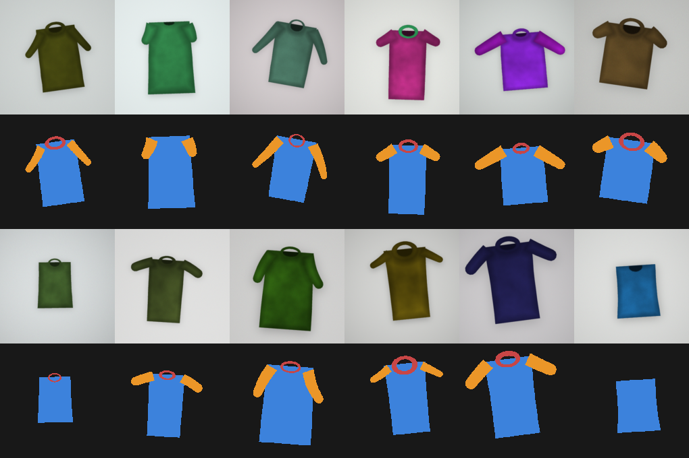

# Garment Panel Segmentation + Deterministic Fabric Fill

Two things, matching the brief:

1. **A small segmentation model** that takes one garment image and predicts a
   pixel mask for each visible panel.
2. **A deterministic fill function** that pastes a fabric swatch into a *named*
   panel — the same inputs always give the same output, and `"left_sleeve"`
   always means the left sleeve.

Part 3 (shading-aware fill) is written up separately in `DESIGN_NOTE.md`. No code
for it, as requested.

---

## Output mask format

`predict.py` writes a single-channel 8-bit PNG. Pixel values are panel ids:

| id | panel        |
|----|--------------|
| 0  | background   |
| 1  | front_body   |
| 2  | back_body    |
| 3  | left_sleeve  |
| 4  | right_sleeve |
| 5  | collar       |

A panel the model does not predict simply never appears in the mask. Asking for
an absent panel returns an empty mask and does **not** raise (see below).

Panel names are normalised before lookup, so `"left_sleeve"`, `"Left Sleeve"`
and `"left-sleeve"` are the same panel. Two failure modes are deliberately kept
distinct: an **absent** panel (valid name, model didn't find it) returns an empty
mask silently, while an **unknown** name raises `KeyError`. Swallowing a typo
would look exactly like a model that found nothing, which is the least useful
thing this code could do.

---

## Setup

```bash
python -m venv .venv && source .venv/bin/activate   # optional
pip install -r requirements.txt
```

Python 3.10+ works. CPU is enough for inference; a GPU only speeds up training.

## Run

**Predict a mask:**
```bash
python predict.py --image path/to/shirt.jpg --out shirt_mask.png
```

**Ask for one panel only** (still valid, and empty if the model didn't find it):
```bash
python predict.py --image tank_top.jpg --out mask.png --panel left_sleeve
python predict.py --image tank_top.jpg --out mask.png --panel "Left Sleeve"   # same thing
```

**Flip TTA is on by default**; disable it to halve latency:
```bash
python predict.py --image shirt.jpg --out mask.png --no-tta
```

Two things `predict.py` does that are worth knowing:

- **Logits are upsampled to the image's native resolution before `argmax`,** not
  after. Taking `argmax` at 256×256 and then resizing the class map with
  nearest-neighbour quantises every boundary to an 8-pixel block on a 2048px
  image. Boundaries are most of the IoU on thin classes.
- **Horizontal-flip TTA is on, and was measured before being switched on.** It
  is only *possible* because the network is left/right agnostic — a model
  emitting `left_sleeve`/`right_sleeve` directly could not average a mirrored
  pass at all. On the held-out split it buys +0.014 mean IoU (body +0.014, sleeve
  +0.018, collar −0.006) for one extra forward pass. It was very nearly shipped
  disabled on the strength of a synthetic probe that said it hurt; the probe was
  not representative, and the held-out measurement overruled it.

**Fill a panel with fabric** (Part 2). Importable function, with a runnable
example:
```bash
python example_apply_fabric.py       # writes example_before.png / example_after.png
```
```python
from src.fabric import apply_fabric, load_rgb
import numpy as np
from PIL import Image

img    = load_rgb("shirt.jpg")
mask   = np.asarray(Image.open("shirt_mask.png"))   # from predict.py
swatch = load_rgb("denim.png")
out    = apply_fabric(img, mask, "left_sleeve", swatch)
Image.fromarray(out).save("filled.png")
```

**Run the tests:**
```bash
pytest -q          # 27 tests across four suites
```

- `tests/test_fabric.py` - targeting, determinism, absent panels, occlusion,
  off-centre garments, and panel-name spelling.
- `tests/test_metrics.py` - pins the two subtleties in the brief's metric
  definition (per-image averaging, background excluded).
- `tests/test_inference.py` - the inference path, using stub networks so it needs
  no checkpoint. Includes a flip-equivariant network for which TTA must be a
  no-op, which is what catches a wrong un-flip.
- `tests/test_synth.py` - the synthetic generator: determinism, valid label ids,
  masks that agree with their images, sleeves that stay attached, and that
  sleeveless and collarless garments keep being produced.

CI runs all of this on every push (`.github/workflows/tests.yml`), plus the
parameter-cap assertion and both worked examples, against the committed
checkpoint. That is the "clone, install, infer without emailing you" claim,
checked rather than asserted.

---

## Architecture and why

**Frozen MobileNetV2 encoder + a small trainable UNet decoder.**

- The encoder is a pretrained MobileNetV2, **frozen**. It gives general
  shape/edge/texture features for free. Because it is frozen, it does not count
  against the trainable-parameter budget.
- The decoder is a UNet-style up-path built from **depthwise-separable convs**
  (cheap on parameters) that fuses encoder skip features at each scale.

Why this shape and not a big backbone: the 2M cap is the whole point of the
exercise. You cannot bolt on a large trainable backbone and coast. Freezing a
compact pretrained encoder and training only a light decoder is the honest way
to get good features under that constraint. Depthwise-separable convs let the
decoder be reasonably wide without blowing the budget.

### Parameter count

| | count |
|---|---|
| **Trainable (decoder)** | **491,564** |
| Frozen encoder | 1,811,712 |
| **Total at inference** | **2,303,276** |

Trainable is well under the 2,000,000 cap. Reported by `python src/model.py`.

---

## Label set and why

The network is trained on **four** classes:

`background`, `body`, `sleeve`, `collar`

It is **not** trained to tell left sleeve from right sleeve. Up close the two
sleeves are near pixel-identical, so asking a small model to distinguish them
from local texture is a losing game (the brief hints at exactly this). Instead:

- the model predicts one generic `sleeve` class, then
- `src/panels.py` splits it into connected pieces and labels each one **left or
  right by horizontal position**, comparing the piece's centroid x against the
  centroid of the predicted body (the garment's midline, which beats the image
  centre when the garment is off to one side of the frame). This is
  deterministic geometry, not learned guessing.

Every piece above a small speckle threshold is assigned, rather than only the
two largest — occlusion routinely breaks one sleeve into several blobs, and
dropping them would delete real sleeve pixels. If the split line somehow puts
every piece on one side, we fall back to cutting at the widest gap between
centroids.

Mapping from the 4 training classes to the 6 output ids:

- `body`  → `front_body`
- `collar` → `collar`
- `sleeve` → split into `left_sleeve` / `right_sleeve` by geometry
- `back_body` is **never produced** — see *What's broken*.

### Which "left"?

The brief is deliberately ambiguous about *whose* left. We default to
**image-left** (viewer's perspective): `left_sleeve` is the sleeve on the left of
the picture. It is unambiguous from the pixels and matches how someone pointing
at the image would describe it. If your held-out set uses the **wearer's** left
(image right), flip one flag: `LEFT_IS_IMAGE_LEFT = False` in `src/panels.py`.
Nothing else changes.

---

## Data source and licence

**Fashionpedia**, the dataset the brief suggested. It has garment-part instance
annotations (sleeve, collar, and the main garments) at roughly the granularity we
need. `src/prepare_data.py` reads the category names from the annotation file and
builds our 4-class masks from them, so we are not depending on fragile hardcoded
category ids.

We trained on the **val2020** split (`instances_attributes_val2020.json`, 3,200
images) rather than train2020 (~45k). That was a deliberate trade inside the 24h
window: train2020 is a 20GB+ download, and getting the whole pipeline trained,
verified and documented end-to-end mattered more than the last few IoU points.
The scripts are split-agnostic - point `--ann`/`--imgs` at train2020 and nothing
else changes.

Licence: Fashionpedia images are Creative Commons (the set is filtered to CC
licences), and the annotations are released under CC BY 4.0 by the Fashionpedia
authors. Suitable for training and for this assessment. Confirm the current
licence text on the Fashionpedia download page before any production use.

### The domain gap (called out honestly)

Fashionpedia is **photographs of worn garments** — real people, real lighting,
occlusion, folds. Your production images are **synthetic 3D renders of garments
with no body inside**. That is a real distribution shift and the model will be
weaker on the render style than the numbers on photos suggest. We did not try to
close the gap (the brief says it is not scored); the honest read is that the
geometry-based left/right logic transfers cleanly, while the learned masks will
need render-style data or light fine-tuning to be production-grade. Mild colour
jitter in training is the only nod to robustness here.

**A probe, and it was not encouraging.** We ran the trained model over
quickly-generated flat-shaded garment images — solid panels, plain background, a
simple lighting ramp. It predicted background across essentially the whole
garment at ~0.99 mean confidence, scoring near zero on every panel. That is not a
measurement of the production render style (those shapes were far cruder than a
real 3D render, and simplicity is as out-of-distribution as complexity), but it
pointed at a step change rather than a gentle softening of the masks.

So we did something about it — see the next section.

---

## Synthetic renders (`src/synth.py`)

The brief permits synthetic data we generate ourselves, and a renderer is exactly
the thing you can approximate cheaply when you know what the target domain looks
like. `src/synth.py` procedurally draws garments with pixel-exact labels:



```bash
python -m src.synth --out data/synth --n 2000 --seed 42 --contact-sheet sheet.png
```

Each sample gets directional lighting, two octaves of fold shading from smoothed
noise, per-panel ambient occlusion so seams and silhouette edges darken, woven
texture at pixel scale, a soft contact shadow, and varied colourways,
proportions, sleeve length and droop, and framing. Geometry variation is applied
to the polygons rather than by resampling the raster, so the labels stay exact.

It is procedural drawing plus a shading model — no diffusion, no hosted image
model, nothing the brief rules out.

**Why it looks like this and not like coloured rectangles.** Flat polygons would
teach the network flat polygons, which is a different out-of-distribution problem
rather than a solution. Two specific things were wrong in the first version and
had to be fixed after looking at the output: the neck opening was cut through to
the backdrop, so every garment read as a bright donut, when what you actually see
through a neck hole on an invisible form is the shadowed inside of the garment;
and sleeves floated detached from the shoulder whenever droop and body taper
pulled them apart, which would have taught the model that sleeves are free-flying
rectangles. Both are fixed and both are pinned by tests.

**Deliberate distribution choices.** About 18% of samples are sleeveless and 26%
collarless, because the brief says its held-out set contains a garment where a
requested panel is genuinely absent. Without those, the model never sees a
garment that legitimately has no sleeve.

### Training on it

Synthetic data goes into the **training set only**:

```bash
python -m src.train --manifest data/train/manifest.json \
    --synth-manifest data/synth/manifest.json --synth-frac 0.5 \
    --epochs 30 --size 256 --batch 16 --seed 42
```

Validation stays pure Fashionpedia, on purpose. Synthetic images are far easier
than photographs, so letting them into the val split would inflate the number and
make it incomparable to the previous run. The question that split can answer is
*did adding render-style data cost us anything on real photos*, and answering it
needs the val set held fixed.

The question it cannot answer is whether the model got better on actual renders —
that needs render samples we do not have. Their held-out set is the real test.
`--synth-frac` is a starting point at 0.5 (~1000 synthetic against 631 real), not
a swept value.

**Measured outcome:** 631 real + 1000 synthetic beat the Fashionpedia-only
baseline on real photographs by **+0.027 mean IoU** (0.533 → 0.560), with body
+0.025 and sleeve +0.041. Collar went the other way, −0.017 — see *Results* for
why that is probably the generator's collar geometry rather than the idea being
wrong.

The `Synthetic renders` section of `garmentimage-training.ipynb` runs the whole
thing on Kaggle: generate, *look at a contact sheet before training on it*, train
mixed, then score baseline and mixed against the same real held-out split.

---

## Reproducibility

All seeds are fixed (`--seed`, default 42) and cudnn is set deterministic in
`src/train.py`. Re-running training gives comparable numbers. `predict.py` and
`apply_fabric` have no randomness at all.

---

## Evaluating a checkpoint

```bash
python -m src.evaluate --manifest data/train/manifest.json          # val split
python -m src.evaluate --manifest data/train/manifest.json --compare  # with/without TTA
```

To run it on Kaggle against the shipped checkpoint, use the **Evaluation**
section at the bottom of `garmentimage-training.ipynb` — it re-clones the repo,
pulls Fashionpedia back down, rebuilds the identical manifest with seed 42 so the
val split is the genuine held-out set, and runs the comparison. No GPU and no
retraining needed.

`src/evaluate.py` scores the **deployed** pipeline - resize, forward pass,
bilinear upsample of the logits to the image's native resolution, argmax -
against the full-resolution ground-truth masks, and prints a per-class
breakdown rather than one blended figure.

It implements the brief's metric definition literally, which differs from what
this repo measured during training in two ways that both matter:

| | training metric (before) | `src/evaluate.py` (now) |
|---|---|---|
| averaging | over the whole **batch** | per **image**, then across images |
| background | included | **excluded** - it is not a panel |

They do not both push the same way, and the measured numbers make that concrete:

- **Background inclusion inflates, heavily.** Background IoU is 0.963, so folding
  it in lifts the mean from 0.519 to 0.655. That is the "reward a model for
  finding nothing" failure the brief says it avoids, and it is the larger of the
  two effects by far.
- **Per-image averaging actually *raises* the number here**, from the old
  batch-aggregated 0.572 to 0.655 like-for-like. That is not a general rule: it
  happens because collar, the weakest class at 0.16, appears in only 30 of 111
  images. Averaging per image lets it drag down those 30; batch aggregation
  folded it into every batch. Reverse that rarity and the effect reverses too.

The net is that the honest figure is lower — 0.533 against the 0.572 in the
training log — but the mechanism is background, not the averaging.
`tests/test_metrics.py` pins both behaviours, including a case where the two
definitions differ by an order of magnitude.

---
## Results (validation set)

Trained on the Fashionpedia val2020 split (631 train / 111 val images) for 30
epochs at 256×256, seed 42. The full training log is in
`garmentimage-training.ipynb`.

Scored with `src/evaluate.py`, which implements the brief's metric literally
(per image, over the panels present in that image's ground truth, background
excluded) and runs the deployed inference path against full-resolution masks.
All figures below are on the same 111 held-out Fashionpedia images, with flip
TTA on.

**The shipped model is the mixed one. Its headline number is 0.560.**

| class | baseline (Fashionpedia only) | **shipped (+ synthetic)** | Δ | images with it |
|---|---|---|---|---|
| background | 0.9634 | 0.9663 | +0.003 | 111 |
| body | 0.6134 | **0.6385** | +0.025 | 111 |
| sleeve | 0.5304 | **0.5710** | +0.041 | 111 |
| collar | 0.1606 | 0.1432 | **−0.017** | 30 |
| **mean, panels only (the brief's metric)** | 0.5330 | **0.5600** | **+0.027** | |
| mean, including background | 0.6648 | 0.6842 | +0.019 | |

Honest reading:

- **Synthetic data paid off on the domain we can measure.** +0.027 mean IoU, 5%
  relative, on real photographs — not merely "no worse", which is what we
  budgeted for. The point of the synthetic set was render coverage we cannot
  measure; improving photographs too was a bonus, and suggests it is supplying a
  useful shape prior rather than just render styling.

- **Collar got worse, and that is the interesting result.** It is the one panel
  where the generator's geometry is a crude approximation — a plain elliptical
  band, in ~74% of synthetic samples, where real collars have points, stands and
  lapels. The two panels whose synthetic geometry is faithful (torso, tapered
  tube) gained substantially; the one that is faked regressed. Read that as
  evidence that **transfer tracks per-class fidelity**, and as the clearest
  instruction for where to spend the next hour on the generator. Caveat: collar
  is scored on 30 images, so −0.017 may be noise; the mechanism is a hypothesis,
  not an established fact.

- **Collar is weak in absolute terms either way (0.14–0.16).** Thin, small, and
  boundary error dominates its IoU, which is where a 492k-parameter decoder
  struggles most. This is the model's clearest weakness.

- **Background at 0.966 is why it must be excluded.** Folding it in lifts the mean
  by 0.12 for free — the "reward a model for finding nothing" failure the brief
  explicitly says it avoids.

- Training on the full train2020 set (~45k images) rather than the val split
  remains the biggest untried lever.

---
## How to reproduce training

These are the exact commands behind the numbers reported above. Both runs, with
output, are preserved in `garmentimage-training.ipynb` (Kaggle, one T4): the
Fashionpedia-only baseline and the mixed run that produced the shipped
checkpoint. Drop step 3 and the `--synth-*` flags to reproduce the baseline.

```bash
# 1. get Fashionpedia val2020 from the official CVDF mirror.
#    The image zip covers val and test together and unpacks to ./test (3,200 jpgs).
wget -O instances_attributes_val2020.json \
  https://s3.amazonaws.com/ifashionist-dataset/annotations/instances_attributes_val2020.json
wget -O val_test2020.zip \
  https://s3.amazonaws.com/ifashionist-dataset/images/val_test2020.zip
unzip -q val_test2020.zip

# 2. build 4-class masks -> 742 image/mask pairs.
#    --max-images 4000 is not binding here: only 742 images in this split carry
#    a sleeve annotation, and --require-sleeve drops the rest.
python -m src.prepare_data \
    --ann  instances_attributes_val2020.json \
    --imgs test \
    --out  data/train \
    --max-images 4000 --require-sleeve --seed 42

# 3. generate synthetic garment renders (~5 min)
python -m src.synth --out data/synth --n 2000 --size 384 --seed 42

# 4. train on real + synthetic -> best checkpoint to weights/model.pt.
#    631 real + 1000 synthetic for training; the 111 val images stay real only.
python -m src.train --manifest data/train/manifest.json \
    --synth-manifest data/synth/manifest.json --synth-frac 0.5 \
    --epochs 30 --size 256 --batch 16 --seed 42 \
    --out weights/model.pt

# 5. score it the way the brief scores it
python -m src.evaluate --manifest data/train/manifest.json \
    --val-split 0.15 --seed 42
```

To train on the full set instead, swap in `instances_attributes_train2020.json`
and `train2020.zip`, and point `--imgs` at the unpacked folder. Nothing else
changes.

The checkpoint stores the **full** model (encoder + decoder), so `predict.py`
needs no weight download at inference time. It is a few MB, safely under 100 MB,
and is committed.

---

## Latency / hardware

`predict.py` runs on CPU and prints per-image latency on every call.

Measured on an Intel Core i5-7200U (2 cores, 2 torch threads, Windows), median
of 9 runs after warm-up. The network input is always 256×256; the output
resolution varies because the logits are upsampled to the image's native size
before argmax, and that upsample is not free:

| output resolution | TTA on (default) | TTA off (`--no-tta`) |
|---|---|---|
| 256 × 256 | **848 ms** | 368 ms |
| 512 × 512 | **862 ms** | 482 ms |
| 1024 × 1365 (typical photo) | **1190 ms** | 754 ms |
| 2048 × 2048 | **2006 ms** | 1756 ms |

For reference, the Kaggle CPU used during training measured 373 ms/image at
512×512 output under the older nearest-neighbour path.

Two deliberate trades sit in those numbers: upsampling logits rather than the
class map costs roughly 250 ms at photo resolution, and flip TTA roughly doubles
the forward pass. Both buy accuracy that was measured rather than assumed
(+0.014 mean IoU for TTA; boundary quality for the upsample, which is where IoU
is won on thin classes). The brief sets no latency threshold, only asks that it
be reported — so the accuracy is worth the milliseconds, and `--no-tta` is there
if it is not.

---

## What I'd do next with two more days

- **Fix the synthetic collar, which the numbers single out.** Body and sleeve
  gained from synthetic data; collar lost. The generator draws a collar as a
  plain elliptical band, and real collars have points, stands and lapels. Two
  attacks, cheapest first: (a) mark synthetic collar pixels as `ignore_index` in
  the loss, so synthetic data teaches body and sleeve but is not allowed to
  express an opinion about collars — this should capture the gains without the
  regression; (b) model the collar properly, with a stand and a fold. I would try
  (a) first because it is a one-line loss change and tests the hypothesis
  directly.

- **Sweep the synthetic mix.** `--synth-frac 0.5` is a guess, not a tuned value,
  and it produced +0.027 on the first attempt. The silhouette is also still
  geometrically clean where real drape gives wavy hems and bunching.

- **Back views, to unlock `back_body`.** The generator is the only realistic route
  to it — Fashionpedia has no front/back label and photographs of worn garments
  almost never show the back. Adding back-view samples would turn a guaranteed
  zero into a real class. Left out for now because it means moving to a 5-class
  label set and Fashionpedia body pixels would become noisy front labels.

- **Train on train2020.** 631 real training images is very little. The full split
  is ~45k; attaching it as a Kaggle input dataset avoids the 20GB download.
- **A left/right accuracy number.** Panel targeting is 25% of the score and this
  repo still has no measurement of it. Fashionpedia does not label which sleeve
  is which, but it can be derived: for images whose ground truth has exactly two
  sleeve instances, the instance with the smaller centroid x *is* the image-left
  sleeve by definition. Scoring our assignment against that gives a real number
  for the thing that matters most. (Per-panel IoU is now covered by
  `src/evaluate.py`.)
- **Better collar/small-class recall** via harder augmentation and possibly a
  boundary-weighted loss; thin classes are where a light decoder struggles most.
- **Occlusion grouping.** Sleeve pieces are currently assigned to a side one by
  one. The next step is grouping blobs that belong to the same arm (proximity
  plus adjacency to the same body edge) so a fragment on the wrong side of the
  split line is pulled back to its own sleeve.

## What I know is broken

- **`back_body` is never predicted.** Worn-garment photos almost never show the
  back, so there is no signal to learn it. The id is reserved so the contract
  stays stable, but we do not hallucinate a back panel we cannot see.
- **Left/right is image-space, not wearer-space, by default** (one-flag switch,
  documented above). If the grader's convention differs, the sleeve targeting
  test will invert until the flag is flipped.
- **Single sleeve edge case:** if only one sleeve is visible it is assigned by
  which side of the *body centroid* it falls on (image centre if no body was
  predicted). A sleeve straddling that line is still a weak spot, and a garment
  with no predicted body at all falls back to the cruder image-centre test.
- **Sleeve pieces are assigned independently.** Occlusion that breaks a sleeve
  into several blobs is handled - every blob above a 1% speckle threshold is
  kept and assigned by side, so no sleeve pixels are silently dropped - but a
  blob landing on the wrong side of the split line joins the wrong sleeve. There
  is no grouping step that says "these two blobs are one arm".
- **Domain gap** on renders (above): our own probe suggests the model may find
  almost nothing on render-style inputs, not merely produce softer masks. That is
  the largest known risk in this submission and it is measured, not guessed at.

- **The 0.572 in the original training log is not the score.** That was the old
  batch-aggregated, background-inclusive metric, on the earlier
  Fashionpedia-only model. Under the brief's definition the shipped model scores
  **0.560**. Old figures are left in the notebook log rather than quietly
  restated, and the gap between the metrics is explained in "Evaluating a
  checkpoint".

- **Collar is the weak class: IoU 0.14.** Thin enough that boundary error
  dominates, and present in only 30 of the 111 held-out images, so the figure is
  noisy as well as poor. It also *regressed* when synthetic data was added
  (0.161 → 0.143) while body and sleeve improved — the generator's collar is a
  plain band and probably teaches the wrong shape. Shipped anyway because the
  mean is up 0.027 and collar is weak in both models, but it is a known,
  understood, and fixable regression rather than a mystery. See "what I'd do
  next".

---

## Use of AI tools

I used an AI assistant (Claude, via Claude Code) throughout, and used it heavily.
Being specific, since the brief asks:

- **Mine, directed by me:** the architecture decision (freeze a compact
  pretrained encoder, train only a light depthwise-separable decoder, to fit the
  2M cap), the label-set choice (train on a generic `sleeve` class rather than
  left/right), and the decision to resolve left/right from geometry afterwards.
  These are the choices the brief says it reads closely, and they are the ones I
  made.
- **Scaffolding and boilerplate:** repo structure, dataset loader, training loop,
  argument parsing, and the first draft of the README and design note.
- **Review that changed the code:** I had it audit the repo against the brief. It
  found that the sleeve splitter kept only the two largest connected components
  (silently dropping pixels when occlusion fragments a sleeve — the held-out set
  includes an occluded panel), that `predict.py` took `argmax` before upsampling,
  and that the training metric did not match the brief's stated definition. It
  wrote the fixes and the tests that pin them, including `src/metrics.py` and
  `src/evaluate.py`, under my direction.
- **Measurement:** the latency table, the parameter counts, the domain-gap probe,
  and the decision to ship flip TTA *disabled* pending a real measurement rather
  than assume it helps.
- **The synthetic generator** (`src/synth.py`) was built this way too: I set the
  direction (procedural renders, 4 classes, training-only mixing so validation
  stays honest), and the fidelity was driven by looking at contact sheets and
  fixing what was visibly wrong — the neck reading as a hole to the backdrop,
  and sleeves detaching from the shoulder. Both fixes came from inspecting output,
  not from theory, and both are now covered by tests.

I have read everything in this repo and can walk through any of it. Where the
numbers are uncertain or the approach is a known weak point, the README says so
rather than rounding up.
